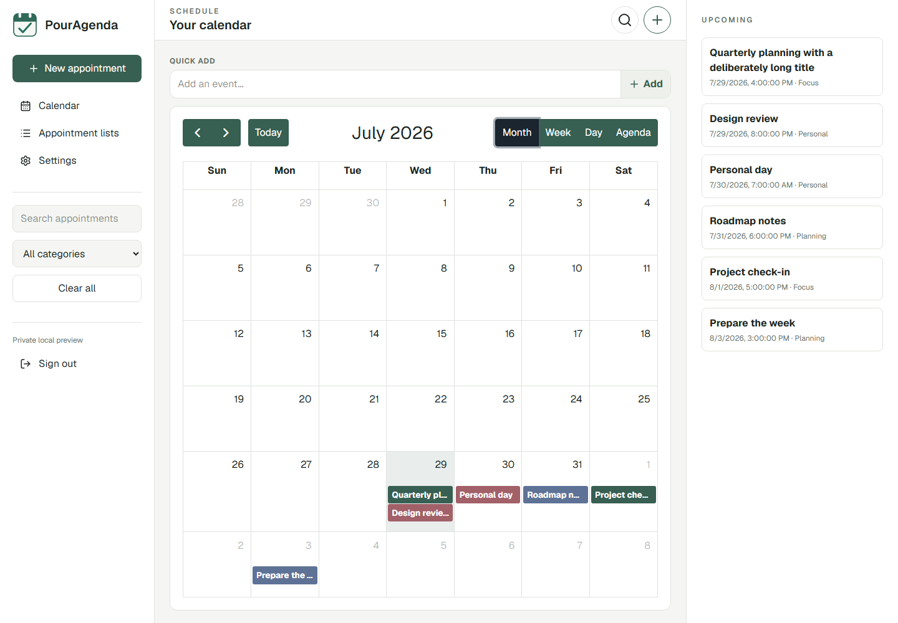
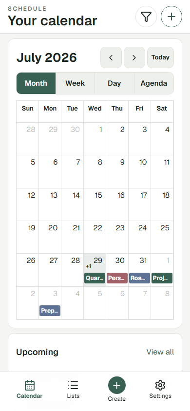
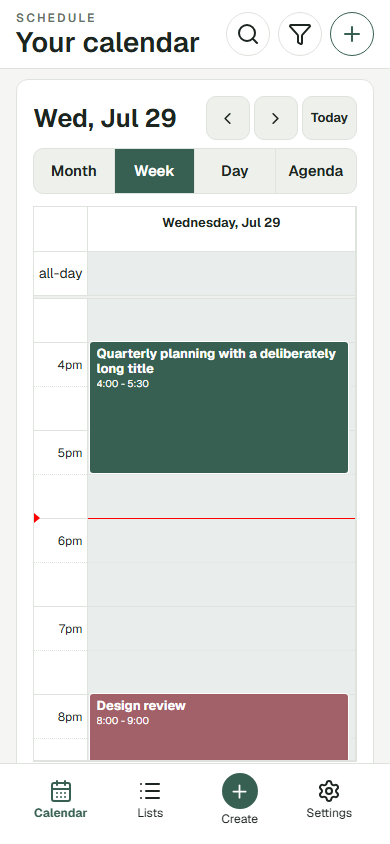

# PourAgenda

**A privacy-first, self-hosted calendar and appointment PWA built with Next.js, Supabase, and Cloudflare.**

[](https://github.com/pour-soi/PourAgenda/releases/tag/v1.0.0)
[](LICENSE)
[](https://nextjs.org/)
[](https://supabase.com/)
[](https://workers.cloudflare.com/)
[](https://web.dev/explore/progressive-web-apps)
[](https://github.com/pour-soi/PourAgenda/actions/workflows/ci.yml)

> **No public hosted demo is provided. To use PourAgenda, deploy your own copy with your own Supabase project and deployment account.**
>
> The repository does not provide access to the author's private deployment or database.

PourAgenda is a responsive personal calendar for people who want to control their application and data. Each installation runs independently on infrastructure controlled by its self-hoster.

## Preview

All preview images use synthetic fixture data. They contain no production account, URL, appointment, or database response.

**Desktop month**



| Mobile month | Mobile week |
| --- | --- |
|  |  |

## Features

### Calendar and appointments

- Month, week, day, and agenda views
- Timed and all-day appointments with create, edit, and delete workflows
- Responsive mobile and desktop layouts
- Timezone-aware timed appointments
- Date-only all-day appointments that remain stable across timezones
- Search, conflict checks, drag, and resize on supported desktop views

### Productivity

- Quick Add and saved default appointment duration
- Daily, weekly, and monthly recurring appointments
- Accessible recurrence edit-scope dialog
- 12-hour, 24-hour, and Follow system time formats
- CSV, JSON, and iCalendar export

### Organization

- Category-only organization and category colors
- Atomic category replacement with Move & Delete
- Appointment lists and category filtering

### Privacy and self-hosting

- Supabase email/password authentication
- PostgreSQL Row Level Security (RLS)
- User-scoped data isolation
- Independent deployment with no owner backend access
- Installable PWA with a deliberately limited offline shell

## Quick Start

1. Clone the repository.
2. Enable Corepack and install dependencies.
3. Create a Supabase project that you own.
4. Copy `.env.example` to `.env.local`.
5. Add your own Supabase Project URL and Publishable key.
6. Apply the repository migrations by following [SUPABASE_SETUP.md](SUPABASE_SETUP.md).
7. Start the local application with `pnpm dev`.
8. Follow [DEPLOYMENT.md](DEPLOYMENT.md) when you are ready to deploy.

```bash
git clone https://github.com/pour-soi/PourAgenda.git
cd PourAgenda
corepack enable
pnpm install --frozen-lockfile
cp .env.example .env.local
pnpm dev
```

Use placeholders only until you replace them locally with values from your own project:

```dotenv
NEXT_PUBLIC_SUPABASE_URL=https://YOUR_PROJECT_REF.supabase.co
NEXT_PUBLIC_SUPABASE_PUBLISHABLE_KEY=YOUR_SUPABASE_PUBLISHABLE_KEY
```

Before entering real data, complete the [Supabase setup guide](SUPABASE_SETUP.md) and [self-hosting checklist](SELF_HOSTING_CHECKLIST.md).

## Documentation

| Document | Purpose |
| --- | --- |
| [README.md](README.md) | Product overview and quick start |
| [SUPABASE_SETUP.md](SUPABASE_SETUP.md) | Create and secure an independent Supabase backend |
| [DEPLOYMENT.md](DEPLOYMENT.md) | Deploy with Cloudflare/OpenNext or run the supported stack yourself |
| [SELF_HOSTING_CHECKLIST.md](SELF_HOSTING_CHECKLIST.md) | Pre-launch privacy, security, and operations checklist |
| [ARCHITECTURE.md](ARCHITECTURE.md) | Application architecture and date/time model |
| [DATABASE.md](DATABASE.md) | Database schema, migrations, and ownership model |
| [SECURITY.md](SECURITY.md) | Security policy and private vulnerability reporting |
| [PRIVACY.md](PRIVACY.md) | Data handling and self-hoster responsibilities |
| [FAQ.md](FAQ.md) | Answers to common setup and deployment questions |
| [CONTRIBUTING.md](CONTRIBUTING.md) | Contribution workflow and privacy requirements |
| [CHANGELOG.md](CHANGELOG.md) | Version history and release changes |

## Privacy and security

- No public hosted demo or shared backend is provided.
- The repository does not provide access to the author's private deployment or database.
- The repository contains no author production data or backend access.
- Every self-hoster uses and controls their own Supabase project.
- Environment files remain local and are ignored by Git.
- Browser code must use only a Supabase Publishable key.
- Never expose a `service_role` key, secret key, database password, or access token.
- RLS is mandatory and must remain enabled for user-owned data.
- Do not share API keys, `.env` files, personal calendar data, email addresses, account identifiers, production logs, or private screenshots in public Issues.

Read [PRIVACY.md](PRIVACY.md), [SECURITY.md](SECURITY.md), and [SELF_HOSTING_CHECKLIST.md](SELF_HOSTING_CHECKLIST.md) before using real data.

## Supported deployment targets

- **Cloudflare/OpenNext:** supported and documented.
- **Self-hosting with the documented stack:** supported.
- **Vercel:** not officially supported or validated.

No shared Worker, domain, Supabase project, or hosted PourAgenda service is supplied. Choose your own Worker name and keep local Wrangler configuration out of Git.

## Project status

- Current stable release: **v1.0.0**
- Distribution model: source-code-only release
- Cloudflare/OpenNext deployment: supported
- Vercel deployment: not officially supported or validated
- Weekly recurrence: one weekday derived from the appointment Start field
- Known build warning: Next.js reports that the `middleware` file convention is deprecated in favor of `proxy`

Reliable closed-app background reminders, multiple weekdays in one weekly recurrence rule, external calendar synchronization, and import are not currently implemented.

## Development and validation

Requirements: Node.js 20.9 or newer and pnpm 11.9.0.

```bash
pnpm run scan:credentials
pnpm typecheck
pnpm lint
pnpm test
pnpm build
```

Authenticated Playwright and live RLS suites require disposable accounts in the tester's own Supabase project. Never point tests at another person's backend or personal account.

## Contributing and support

- [Report a bug](https://github.com/pour-soi/PourAgenda/issues/new?template=bug_report.yml)
- [Request a feature](https://github.com/pour-soi/PourAgenda/issues/new?template=feature_request.yml)
- [Read the contributing guide](CONTRIBUTING.md)
- [Report a security issue privately](SECURITY.md)

Do not include API keys, `.env` files, production logs, real appointments, email addresses, account identifiers, production URLs, or private screenshots in public Issues or pull requests.

## License

PourAgenda's original source and project artwork are licensed under the [MIT License](LICENSE). Third-party software, fonts, icons, and trademarks remain under their respective terms; see [THIRD_PARTY_NOTICES.md](THIRD_PARTY_NOTICES.md).
